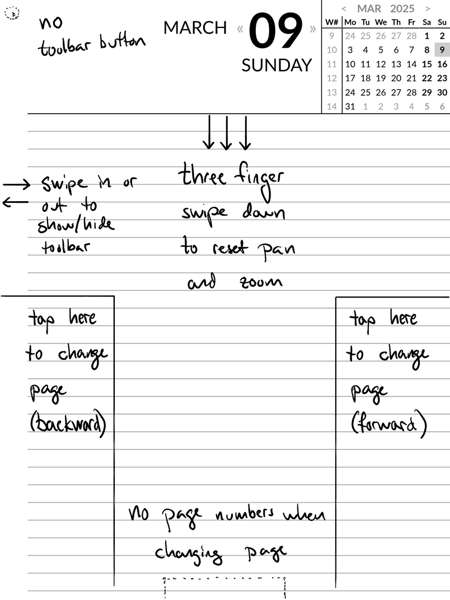

# Extensions for xovi on a reMarkable

These are extensions for the reMarkable tablets.

They enable
 - Navigation between pages using the type folios
 - A reader mode, with the entire UI hidden (page numbers, toolbar button), and where you can use taps to scroll and change page

## How to install

All these qmd extensions require that you first install [xovi](https://github.com/asivery/rmpp-xovi-extensions/blob/master/INSTALL.MD) and [qt-resource-rebuilder](https://github.com/asivery/rmpp-xovi-extensions/tree/master/qt-resource-rebuilder) on your reMarkable (rM1, rM2 or RMPP)

Add the extensions you want to apply to the /home/root/xovi/exthome/qt-resource-rebuilder folder on your device and restart xovi by running ~/xovi/start

Combine changeVerticalJump.qmd, gestures.qmd, hidePageLabelsInFullscreen.qmd and hideShowToolbar.qmd to get a clean fullscreen view where you can tap in the corners to change pages. Or when viewing a portrait document in landscape mode: Tap in the corners to scroll a page down and then change page on the next tap.

.qmd-files in the 3.18 folder are hashed using hashes from 3.18, but probably also work on previous or later versions.

## changeVerticalJump.qmd
Increase the distance when scrolling down a page, such that the overlap is only 10%.

## delayStrokeRefresch.qmd
Delays the refresh after making a colored stroke, such that the color is not updated until a period of 10 seconds with no interaction with the tablet.

## enableAllColors.qmd
Use on rM1 and rM2 to enable the fulle color selection from the RMPP

## enableShortcuts.qmd
Enable keyboard shortcuts for navigation:
- Left/right arrow to change page
- Up/down arrow to scoll up/down one screen

Shortcuts are *not* enabled when in text mode.

## gestures.qmd
Add the following gestures and tap areas:
- Swipe down with three fingers to reset pan and zoom, i.e. to scroll to top of the page and zoom to 100%
- Swipe out and in from the toolbar to show/hide the toolbar
- When the toolbar is hidden, tap on the bottom right to scroll down, and to change to the next page if you are already nearly at the bottom) (no scrollbar shown)
- When the toolbar is hidden, tap on the bottom left to scroll up, and to change to the previous page if you are already nearly at the top) (no scrollbar shown)
- In .pdf and .epub documents: Tap with four fingers to toggle between Off and Full screen for the contrast filter

.pdf links in the tap area cannot be activated. Exit fullscreen mode before using them.

## enableShortcutsWithScrollOrChangePage.qmd
**Must** be installed **together with** *gestures.qmd* and must be installed **instead of** *enableShortcuts.qmd*. It then adds the following keyboard shortcuts
- Left/right arrow to change page
- Up/down arrow to scoll up/down one screen or to change page if already at the top/bottom of the page
- Physical page turn buttons on the rM1 scoll up/down one screen or change page if already at the top/bottom of the page
- On rM1 or rM2 if you install the [remarkable-stylus plugin](https://github.com/mb1986/remarkable-stylus) you can use the side button to erase selection and the rubber eraser as a regular eraser (on rM1 the plugin is currently broken in notebooks, but works in .pdfs - if you compile it yourself and change the keypress from Ctrl+I to Ctrl+T this extension will also work in notebooks)

Shortcuts are *not* enabled when in text mode.

## hideDocumentClose.qmd
Hide the close button in an open document. Slide down from the top to close the document.

## hidePageLabelsInFullscreen.qmd
Hide the page numbers at the bottom of the screen when the toolbar is hidden. On the very last page the page nuumbers are still shown. To show the page numbers slide up from the bottom to show the page slider.

## hideShowToolbar.qmd
Hide the button for showing the toolbar. Should definitely only be used with gestures.qmd or a similar activation of a gesture to show the toolbar (if not you will be unable to get the toolbar back until you restart the device)

## miniLightSleep.qmd
Show a line of text at the bottom right corner instead of the light sleep banner.

## feverLightSteps.qmd
For the rmpp (do **not** use on rM2 or rM1). Changes the 5 level light slider in quick settings to a 4 level slider, such that you can choose 0%, 25%, 50%, 75% and 100% light intensity. In settings (long press the lamp symbol below the slider), you can still choose 20%, 40% and 60%, thus increasing the number of different levels.
