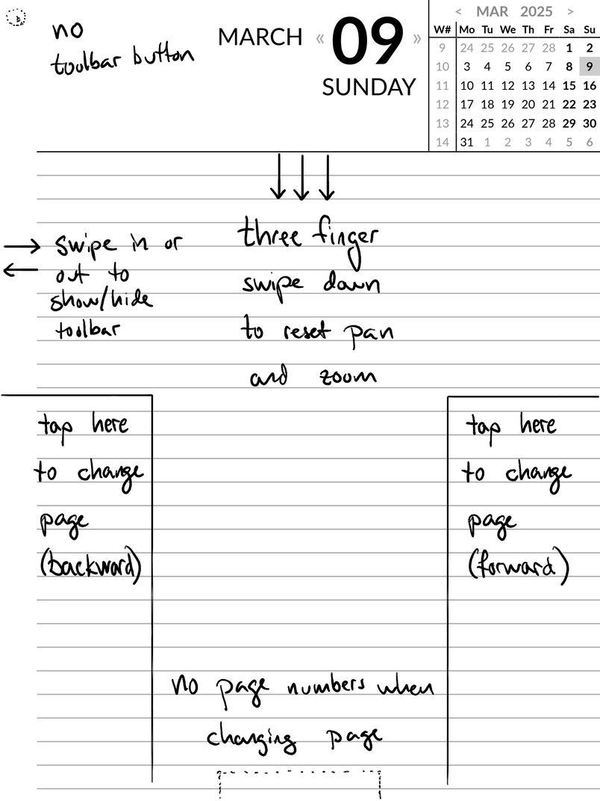

# Extensions for xovi on a reMarkable

These are extensions for the reMarkable tablets. All extensions are made for personal use to improve the user interface or add extra functionality. Many of the extensions are probably only relevant for a very small number (>= 1) of people, whereas other extensions might be relevant for a large group. Most extensions can be installed independently of the others, or you can install all files.

They enable
 - Navigation between pages using the type folios or other keyboards (or even Bluetooth page turners)
 - A reader mode, with the entire UI hidden (page numbers, toolbar button), and where you can use taps to scroll and change page
 - A few ui fixes, e.g. usage of Custom Fit zoom across devices and screen orientations, KOReader in landscape mode when using typefolio.
 - A bunch of small improvements.

Combine changeVerticalJump.qmd, gestures.qmd, hidePageLabelsInFullscreen.qmd and hideShowToolbar.qmd to get a clean fullscreen view where you can tap in the corners to change pages. Or when viewing a portrait document in landscape mode: Tap in the corners to scroll a page down and then change page on the next tap.

.qmd-files in the folders for older versions are hashed using hashes from that version, but probably also work on previous or later versions.

New changes will only be applied to the latest release.



## How to install

Most of the extensions are available in [vellum](https://vellum.delivery) and [reManager](https://remanager.io) and I suggest installing that way. It's also possible to install manually.

### How to install manually

All these qmd extensions require that you first install [xovi](https://github.com/asivery/rmpp-xovi-extensions/blob/master/INSTALL.MD) and [qt-resource-rebuilder](https://github.com/asivery/rmpp-xovi-extensions/tree/master/qt-resource-rebuilder) on your reMarkable (rM1, rM2 or rM Paper Pro, rM Paper Pro Move, rM Paper Pure)

Add the extensions you want to apply to the /home/root/xovi/exthome/qt-resource-rebuilder folder on your device and restart xovi by running ~/xovi/start

# Available extensions

## Gestures and shortcuts

### navigateUsingArrowKeys.qmd
(Requires scrollScreenUpOrDown.qmd)
Enable keyboard shortcuts for navigation:
- Left/right arrow to change page
- Up/down arrow to scoll up/down one screen 

Shortcuts are *not* enabled when in text mode.

### tapToChangeViewOrPage.qmd
(Requires scrollScreenUpOrDown.qmd)
Add the following gestures and tap areas:
- When the toolbar is hidden, tap on the bottom left to scroll up, and to change to the previous page if you are already nearly at the top) (no scrollbar shown)

.pdf links in the tap area cannot be activated. Exit fullscreen mode before using them.

### threeFingerSwipeToResetView.qmd
Add the following gesture:
- Swipe down with three fingers to reset pan and zoom, i.e. to scroll to top of the page and zoom to 100%

### swipeToHideOrShowToolbar.qmd
Add the following gestures:
- Swipe out and in from the toolbar to show/hide the toolbar - for horizontal toolbar, the swipe only works at the show toolbar button (in order not to interfere with native gestures)

### fourFingerChangeFilter.qmd
Add the following gesture:
- In .pdf and .epub documents: Tap with four fingers to toggle between Off and Full screen for the contrast filter

### fourFingerSwipeForLastDoc.qmd
Add the following gesture:
- Swipe right with four fingers to open the previously opened document.
Requires ingatellentSettings.qmd

### fourFingerSwipeLeftForCompleteAndOpenNextDoc.qmd
Add the following gesture:
- Swipe left with four fingers to move the open document into the first folder in the current folder and open the first document in the current folder. If no folder exists a folder named "Completed" is made created. If the current folder is empty the document is closed.

### shortcutsToChooseEraser.qmd
- On rM1 or rM2 if you install the [remarkable-stylus plugin](https://github.com/mb1986/remarkable-stylus) you can use the side button to erase selection and the rubber eraser as a regular eraser (on rM1 the plugin is currently broken in notebooks, but works in .pdfs - if you compile it yourself and change the keypress from Ctrl+I to Ctrl+T this extension will also work in notebooks)

### buttonPressForPenChange.qmd
When installed you can press the side button on a pen to erase selection. If you click once (short), the tool changes to selection. If you prefer to use the eraser and not selection eraser, you can look for the little `(8)` in the code and change it to a `(6)`. If you double click you change to the previous tool in the toolbar (eraser tool ignored). Requires [rm-stylus](https://github.com/rmitchellscott/rm-stylus).

### rubberEraserForRm1.qmd
Make the rubber eraser on a pen work as eraser on rM1. Requires [rm-stylus](https://github.com/rmitchellscott/rm-stylus).

### closeFolderOnCtrlUp.qmd
Adds the shortcut `Ctrl + Up` (known from macOS) for navigating the parent folder in the navigator.

### shortcutForSplitView.qmd
Adds the shortcurt `Ctrl + S` for toggling split view. Requires splitView.qmd.


## New functionality

### splitView.qmd
Adds a button to the quick settings panel, which toggles a split view for both the navigator and a secondary document. Also makes it possible to run an appload app next to a document (instead of on top of the document).

Requires ingatellentSettings.qmd.

If you want to use without Appload, remove these two lines from the file
```
                apploadVKB: ~&254550717068498203&~
                apploadWindowParent: ~&254550717068498203&~
```

### addPalettes.qmd
Make it possible to change the color palette by clicking the heading. You can add your own palette by creating the folder `/home/root/colorPalettes/` and adding qml files with color information. See the folder `colorPallettes` for two examples of such custom palettes.

### addAspectLockToSelection.qmd
Adds a lock/unlock button for aspect ratio to the selection context menu. Makes it possible to resize strokes and images without keeping the original aspect ratio.

### enableAllColors.qmd
Use on rM1 and rM2 to enable the full color selection from the RMPP

### addTagsToContextMenu.qmd
Add a tag directly from the context menu, when you have selected text. Works on handwritten text (requires Connect or rmfakecloud with handwriting recognition enabled) typed text on notepages, or on selected text from a .pdf file or .epub file (experimental setting must be enabled).

### randomSleepScreen.qmd
Picks a random sleep screen image from the folder `~/sleepScreens/`. Falls back to the chosen path in xochitl.conf (`SleepScreenPath=...`) if no .png images are found.

### addCompletedButton.qmd
This adds a [Completed] button, when selecting documents in the main navigator. The button is visible if the current folder contains at least one subfolder, and pressing the button moves the document to the first subfolder. This can be used if you review a lot of documents, and have created a subfolder to the ones you have alredy reviewed, then you can easily move a reviewed document to the subfolder (without leaving the current view and scroll location).
### addTrashcanToSelection.qmd
Adds a trashcan when selecting strokes. When activating the strokes are deleted (leaving the clipboard unchanged).

### changeGreenColor.qmd
Change the default green color to a much darker color. Works in exports both on device and through reMarkable's apps.

You can change your own colors (or the green one), by editing (or even dublicating and editing) this part of the code

```
INSERT TEMPLATE changeColorDefinitionsTemplate {
    originalToolColor: 10
    newToolColor: 9
    newToolrgb: (0xFF338833)
    newDisplayColor: "#338833"
}
```
You probably always want `newToolColor` to be `9`. The original colors are like this
```
    BLACK = 0,
    GRAY = 1,
    WHITE = 2,
    YELLOW = 3,
    GREEN = 4,
    PINK = 5,
    BLUE = 6,
    RED = 7,
    GRAY_OVERLAP = 8,
    ARGB = 9,
    GREEN_2 = 10,
    CYAN = 11,
    MAGENTA = 12,
    YELLOW_2 = 13,
```


## UI changes
### hideDocumentClose.qmd
Hide the close button in an open document. Slide down from the top to close the document.

### hidePageLabelsInFullscreen.qmd
Hide the page numbers at the bottom of the screen when the toolbar is hidden. On the very last page the page nuumbers are still shown. To show the page numbers slide up from the bottom to show the page slider.

### hideShowToolbar.qmd
Hide the button for showing the toolbar. Should definitely only be used with gestures.qmd or a similar activation of a gesture to show the toolbar (if not you will be unable to get the toolbar back until you restart the device)

### miniLightSleep.qmd
Show a line of text at the bottom right corner instead of the light sleep banner.

### fewerLightSteps.qmd
For the rmpp (do **not** use on rM2 or rM1). Changes the 5 level light slider in quick settings to a 4 level slider, such that you can choose 0%, 25%, 50%, 75% and 100% light intensity. In settings (long press the lamp symbol below the slider), you can still choose 20%, 40% and 60%, thus increasing the number of different levels.

### enableExtraPenOnMove.qmd
For the rmppm only. Adds the extra pen slot to the toolbar. - Requires ≥ v16 of qt-resource-rebuilder

### enableLandscapeSleep.qmd
Stop the tablet from forcing portrait display for the sleep screen.

### quickSettingsClock.qmd
Adds a ticking clock to the quick settings panel.

### showToolOnChange.qmd
Shows a visual cue when changing the tool in the toolbar. Useful if you hide the toolbar and change tools using gestures or buttons.

## Bug fixes
 

### forceKoreaderLandscape.qmd
Keeps the appload app KOReader in the same aspect ratio as the screen - also when using the type folio. Small caveat: The gesture for showing the topbar is swipe in from the left when using the tablet in landscape mode.

### fixCustomFit.qmd
When this is installed the Custom Fit zoom is automatically adjusted across devices and orientations, such that if you choose a custom fit for a document, the visible part of the document will be the same on all devices, no matter which orientation.
This mod works by assuming that all custom fits has been made on an rmpp in landscape mode, and also adjust the saved custom fit if it is saved from another device. Any documents ajusted on other devices than rmpp or in portrait must be readjusted after installation (and after uninstall).
If you primarily use another device you can change from the rmpp dimensions 1620 x 2160 to other dimensions in the code (or you can swap the numbers to use portrait as the primary view). In all other views than the primary view, the image needs an extra refresh when chaning page, since the reMarkable software preloads the part of the page, it thinks it needs to show.

### fixFilters.qmd
There's a long standing bug, where the chosen filters in the sidebar in the main file explorer are not highlighted even though they are active. The name of the sidebar row (Filter by) is also not correctly updated with the name of the current filter. This fixes this bug.

### fixNavigateUpShortcut.qmd
Fixes the shortcuts Ctrl + W and ESC for closing the current folder.


## Small changes

### changeVerticalJump.qmd
Increase the distance when scrolling down a page, such that the overlap is only 10%.

### delayStrokeScreenRefresh.qmd
Delays the refresh after making a colored stroke, such that the color is not updated until a period of 10 seconds with no interaction with the tablet.

### ingatellentSettings.qmd
Used by some of the extensions to save settings across reboots.

## Alpha releases

You can sometimes find non listed .qmd files in the repository. These are changes that are not quite polished or may contain many more bugs, than the listed extensions.
